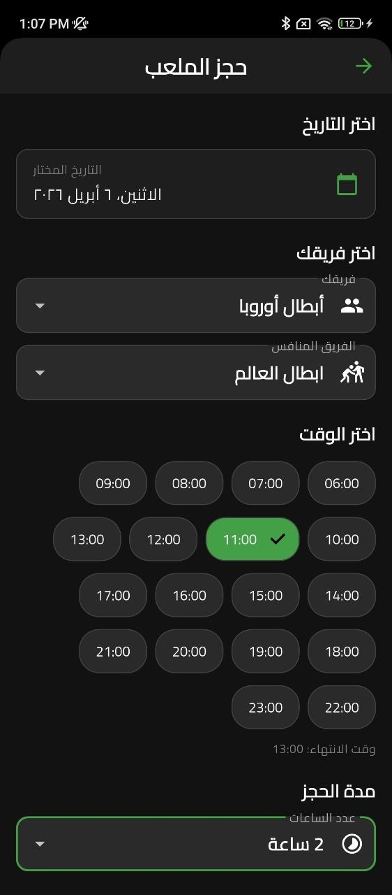
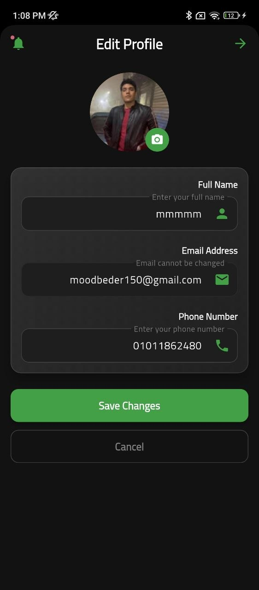

# Korateem

Korateem is a modern, cross-platform mobile app built with Flutter, designed to deliver a seamless and intuitive experience across Android, iOS, web, Windows, macOS, and Linux.

## Features

- **Cross-platform support:** Android, iOS, web, Windows, macOS, and Linux.
- **Firebase integration:** Real-time database, authentication, and cloud storage.
- **Modern, responsive UI:** Consistent and beautiful design across all devices.
- **Modular architecture:** Clean, maintainable, and scalable codebase.
- **Google Maps integration:** Location-based features for enhanced user experience.
- **Image picker:** Users can upload or select images from their device.
- **Secure authentication:** Robust user sign-in and management with Firebase Auth.
- **Multi-language support:** Documentation in English and Arabic.
- **Automated testing:** Widget and smoke tests for reliability.

## Screenshots

Below are some screenshots and a demo video of the app in action:








## Demo Video

[▶ Watch Demo Video](assets/screenshots/202604061415%20(2).mp4)

---

## Getting Started

1. Clone the repository:
	```bash
	git clone https://github.com/your-username/korateem.git
	```
2. Install dependencies:
	```bash
	flutter pub get
	```
3. Run the app:
	```bash
	flutter run
	```

## License

This project is open source and available under the [MIT License](LICENSE).

---

Feel free to contribute or reach out for collaboration!
