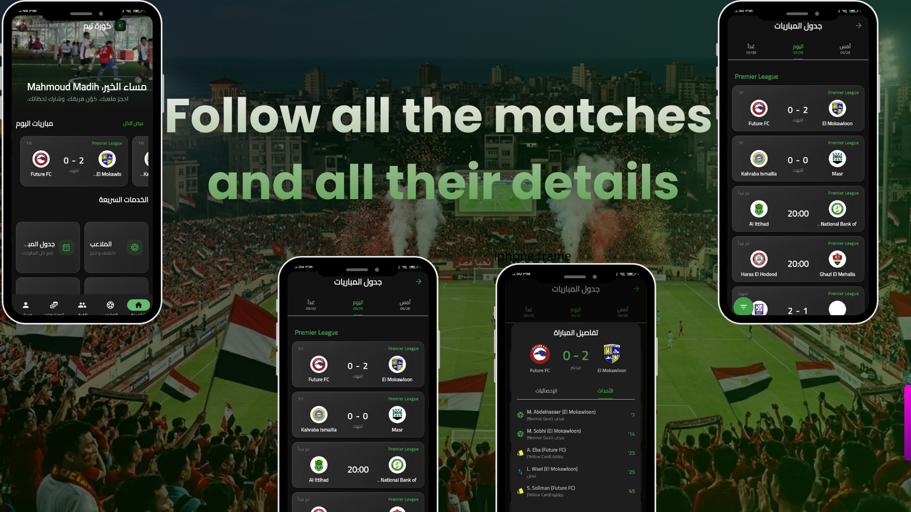
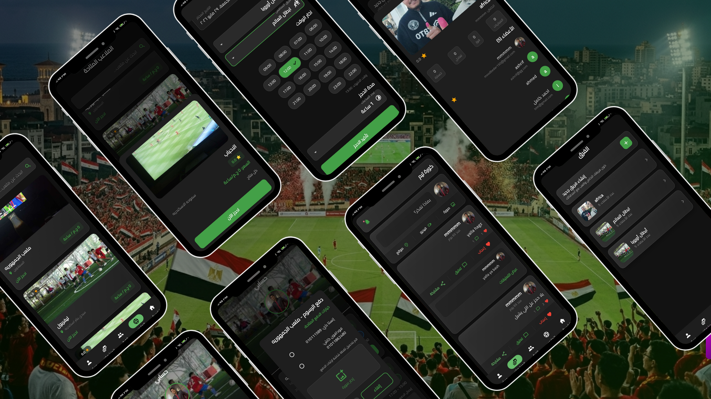

<!-- 🚀 Korateem - Premium Mobile App for Stadium Management -->

<div align="center">
  <h1>
    
  </h1>

  <p>
    <strong>A modern, cross-platform Flutter application for stadium management and bookings</strong>
  </p>

  <p align="center">
    <a href="#-showcase"><strong>Showcase</strong></a> •
    <a href="#-features"><strong>Features</strong></a> •
    <a href="#-gallery"><strong>Gallery</strong></a> •
    <a href="#-quick-start"><strong>Quick Start</strong></a> •
    <a href="#-tech-stack"><strong>Tech Stack</strong></a> •
    <a href="#-license"><strong>License</strong></a>
  </p>

  <!-- Badges -->
  <p>
    
    
    
    
    
    
  </p>
</div>

---

## 🎯 Showcase

Experience the final result of **Korateem** – a beautifully designed stadium management application:

<div align="center">
  <table border="0">
    <tr>
      <td align="center" width="25%">
        
        <br>
        <small><strong>Home Screen</strong></small>
      </td>
      <td align="center" width="25%">
        
        <br>
        <small><strong>Stadium Booking</strong></small>
      </td>
      <td align="center" width="25%">
        
        <br>
        <small><strong>Profile Management</strong></small>
      </td>
      <td align="center" width="25%">
        
        <br>
        <small><strong>Payments & History</strong></small>
      </td>
    </tr>
  </table>
</div>

---

## ✨ Features

**🏟️ Stadium Management**
- Browse and discover available stadiums with detailed information
- Real-time availability and booking status
- Location-based stadium discovery with Google Maps integration
- Detailed stadium profiles with amenities and facilities

**📅 Smart Booking System**
- Intuitive date and time selection for reservations
- Instant booking confirmation with QR codes
- Flexible cancellation and rescheduling options
- Booking history and past reservations

**👤 User Experience**
- Secure authentication with Firebase (Email, Google Sign-In)
- Comprehensive user profile management
- Payment integration for seamless transactions
- Push notifications for booking updates

**🎨 Modern UI Design**
- Beautiful, responsive user interface
- Consistent design language across all screens
- Dark mode support
- Smooth animations and transitions

**🔒 Security & Performance**
- End-to-end encrypted communications
- Secure data storage with Firestore
- Optimized performance across all platforms
- Clean, maintainable architecture  

---

## 🎨 Gallery

<div align="center">
  <h3>App Screenshots & User Interface</h3>
  
  <table border="0" width="100%">
    <tr>
      <td align="center" width="50%">
        
      </td>
      <td align="center" width="50%">
        
      </td>
    </tr>
    <tr>
      <td align="center" width="50%">
        
      </td>
      <td align="center" width="50%">
        
      </td>
    </tr>
    <tr>
      <td align="center" width="50%">
        
      </td>
      <td align="center" width="50%">
        
      </td>
    </tr>
    <tr>
      <td align="center" width="50%">
        
      </td>
      <td align="center" width="50%">
        
      </td>
    </tr>
  </table>
</div>

---

## 📸 Screenshots

<div align="center">
  <table>
    <tr>
      <td></td>
      <td></td>
      <td></td>
      <td></td>
    </tr>
    <tr>
      <td></td>
      <td></td>
      <td></td>
      <td></td>
    </tr>
    <tr>
      <td></td>
      <td></td>
      <td></td>
      <td></td>
    </tr>
    <tr>
      <td></td>
      <td></td>
      <td></td>
      <td></td>
    </tr>
  </table>
</div>

---

## 🎬 Demo Video

<p align="center">
  <a href="assets/screenshots/202604061415%20(2).mp4">
    
  </a>
</p>

> **Note:** Click the badge above to view or download the demo video.  
> If the video doesn't play in your browser, please download it locally.

---

## 🚀 Quick Start

### Prerequisites

Before you begin, ensure you have the following installed:

- **Flutter SDK** (>=3.22.0) – [Install Flutter](https://flutter.dev/docs/get-started/install)
- **Dart SDK** (automatically included with Flutter)
- **Git** – For version control
- **IDE** – VS Code, Android Studio, or IntelliJ IDEA
- **Firebase Project** – [Create one here](https://console.firebase.google.com/)

### Installation & Setup

#### 1️⃣ Clone the Repository
```bash
git clone https://github.com/MahmoudMadihBedier/korateem.git
cd korateem
```

#### 2️⃣ Install Dependencies
```bash
flutter pub get
```

#### 3️⃣ Configure Firebase
- Create a Firebase project in the [Firebase Console](https://console.firebase.google.com/)
- Enable the following services:
  - ✅ Authentication (Email & Google)
  - ✅ Realtime Database
  - ✅ Cloud Storage
  - ✅ Firestore (optional)

#### 4️⃣ Setup Firebase Configuration Files
- For **Android**: Download `google-services.json` and place it in `android/app/`
- For **iOS**: Download `GoogleService-Info.plist` and add it to the Xcode project

#### 5️⃣ Run the App

**On Android Emulator/Device:**
```bash
flutter run -d android
```

**On iOS Simulator/Device:**
```bash
flutter run -d ios
```

**On Web:**
```bash
flutter run -d chrome
```

---

## 🏗️ Tech Stack

| Category | Technology | Purpose |
|----------|-----------|---------|
| **Framework** | Flutter 3.22+ | Cross-platform UI development |
| **Language** | Dart 3.0+ | Primary programming language |
| **Backend** | Firebase | Authentication, Database, Storage |
| **State Management** | Riverpod / Provider | Business logic management |
| **Maps** | Google Maps SDK | Location-based features |
| **Image Handling** | Image Picker | User image uploads |
| **Authentication** | Firebase Auth | Secure user authentication |
| **Database** | Firestore / Realtime DB | Data persistence |
| **Storage** | Firebase Storage | File management |
| **Testing** | Flutter Test | Unit and widget tests |

---

## 🎯 Architecture

Korateem follows **Clean Architecture** principles with clear separation of concerns:

```
lib/
├── core/                          # Core utilities & constants
│   ├── constants/                # App-wide constants
│   ├── errors/                   # Error handling classes
│   ├── extensions/               # Dart extensions
│   └── utils/                    # Helper utilities
│
├── features/                      # Feature modules
│   ├── auth/                     # Authentication feature
│   │   ├── data/                # Data layer
│   │   ├── domain/              # Business logic layer
│   │   └── presentation/        # UI layer
│   │
│   ├── stadium/                 # Stadium feature
│   │   ├── data/
│   │   ├── domain/
│   │   └── presentation/
│   │
│   ├── booking/                 # Booking feature
│   │   ├── data/
│   │   ├── domain/
│   │   └── presentation/
│   │
│   └── profile/                 # User profile feature
│       ├── data/
│       ├── domain/
│       └── presentation/
│
├── main.dart                      # App entry point
└── firebase_options.dart          # Firebase configuration
```

### Architecture Layers

1. **Presentation Layer** – UI components, pages, and state management
2. **Domain Layer** – Business logic, use cases, and entities
3. **Data Layer** – Repositories, data sources, and models
4. **Core Layer** – Shared utilities, constants, and extensions

---

## 📱 Supported Platforms

| Platform | Status | Notes |
|----------|--------|-------|
| 🤖 Android | ✅ Fully Supported | Tested on Android 8.0+ |
| 🍎 iOS | ✅ Fully Supported | Tested on iOS 12.0+ |
| 🌐 Web | ✅ Fully Supported | Chrome, Firefox, Safari |
| 🪟 Windows | ✅ Supported | Windows 10+ |
| 🍎 macOS | ✅ Supported | macOS 10.13+ |
| 🐧 Linux | ✅ Supported | Ubuntu 18.04+ |

---

## 🔄 Key Features Breakdown

### 🔐 Authentication System
- Email/password registration and login
- Google Sign-In integration
- Secure session management
- Password recovery functionality
- Account verification

### 🏟️ Stadium Management
- Browse available stadiums
- Detailed stadium profiles with amenities
- Location-based search with Google Maps
- Rating and review system
- Stadium availability calendar

### 📅 Booking System
- Intuitive booking interface
- Real-time availability checking
- Multiple payment options
- Booking confirmation with QR codes
- Cancellation and rescheduling

### 👤 User Profile
- Profile information management
- Booking history and statistics
- Saved favorite stadiums
- Payment methods management
- Preferences and settings

---

## 🧪 Testing

The project includes comprehensive tests:

```bash
# Run all tests
flutter test

# Run tests with coverage
flutter test --coverage

# Run specific test file
flutter test test/widget_test.dart
```

**Test Coverage:**
- ✅ Widget tests for UI components
- ✅ Unit tests for business logic
- ✅ Smoke tests for app integrity
- ✅ Integration tests (Firebase)

---

## 📦 Key Dependencies

Main packages used in the project:

```yaml
# State Management & Patterns
riverpod: latest
provider: latest

# Firebase & Backend
firebase_core: ^0.7.0
firebase_auth: ^4.0.0
cloud_firestore: ^4.0.0
firebase_storage: ^11.0.0

# UI & UX
google_maps_flutter: ^2.0.0
image_picker: ^0.8.0
flutter_svg: ^2.0.0

# API & Networking
http: ^1.0.0
dio: ^5.0.0

# Local Storage
shared_preferences: ^2.0.0
hive: ^2.0.0

# Date & Time
intl: ^0.19.0
```

Complete dependency list in [pubspec.yaml](pubspec.yaml).

---

## 🤝 Contributing

We welcome contributions! Here's how you can help:

### 1. Fork the Repository
```bash
git clone https://github.com/YOUR_USERNAME/korateem.git
cd korateem
```

### 2. Create a Feature Branch
```bash
git checkout -b feature/amazing-feature
```

### 3. Make Your Changes
- Follow the existing code style
- Write clean, well-documented code
- Add tests for new features

### 4. Commit & Push
```bash
git add .
git commit -m "Add amazing feature"
git push origin feature/amazing-feature
```

### 5. Open a Pull Request
- Describe the changes clearly
- Link any related issues
- Wait for review & feedback

### Code Style Guidelines
- Use meaningful variable and function names
- Follow Dart naming conventions
- Keep functions small and focused
- Add comments for complex logic
- Follow the Clean Architecture pattern

---

## 🐛 Troubleshooting

### Build Issues

**Issue**: `Flutter build fails with Firebase error`
```bash
# Solution: Update Firebase dependencies
flutter pub upgrade
flutter pub get
```

**Issue**: `Google Maps API key not working`
- Verify API key in Android Manifest and Info.plist
- Check Firebase configuration files
- Ensure Maps API is enabled in Google Cloud Console

**Issue**: `Permission errors on Android`
- Update `android/build.gradle` to use latest Gradle version
- Ensure `android/gradle.properties` has correct configurations

### Runtime Issues

**Issue**: `App crashes on startup`
- Check Firebase configuration
- Review logs: `flutter logs`
- Verify all required permissions are granted

**Issue**: `Authentication not working`
- Check Firebase authentication methods are enabled
- Verify Firebase project configuration
- Check network connectivity

---

## 📚 Documentation

- [Flutter Documentation](https://flutter.dev/docs)
- [Firebase Documentation](https://firebase.google.com/docs)
- [Dart Documentation](https://dart.dev/guides)
- [Google Maps API](https://developers.google.com/maps/documentation)

---

## 📝 Project Structure

For detailed architectural documentation, see:
- [IMPLEMENTATION_GUIDE.md](IMPLEMENTATION_GUIDE.md)
- [ADVANCED_FEATURES.md](ADVANCED_FEATURES.md)
- [FIREBASE_SETUP_GUIDE.md](FIREBASE_SETUP_GUIDE.md)
- [ACTION_PLAN.md](ACTION_PLAN.md)

---

## 🎯 Roadmap

### Phase 1 ✅ (Completed)
- ✅ Core app structure and navigation
- ✅ Firebase integration
- ✅ User authentication
- ✅ Stadium browsing and discovery
- ✅ Basic booking system

### Phase 2 (In Progress)
- 🔄 Payment integration
- 🔄 Advanced search filters
- 🔄 User reviews and ratings
- 🔄 Push notifications

### Phase 3 (Planned)
- 📋 Admin dashboard
- 📋 Analytics and reporting
- 📋 Multi-language support expansion
- 📋 Offline functionality
- 📋 Advanced booking analytics

---

## 👥 Team & Credits

**Developed by:** [Mahmoud Madih Bedier](https://github.com/MahmoudMadihBedier)

Special thanks to:
- Flutter community for excellent documentation
- Firebase for reliable backend services
- All contributors and testers

---

## 📄 License

This project is licensed under the **MIT License** - see the [LICENSE](LICENSE) file for details.

```
MIT License

Copyright (c) 2024 Mahmoud Madih Bedier

Permission is hereby granted, free of charge, to any person obtaining a copy
of this software and associated documentation files (the "Software"), to deal
in the Software without restriction, including without limitation the rights
to use, copy, modify, merge, publish, distribute, sublicense, and/or sell
copies of the Software, and to permit persons to whom the Software is
furnished to do so, subject to the following conditions:

The above copyright notice and this permission notice shall be included in all
copies or substantial portions of the Software.

THE SOFTWARE IS PROVIDED "AS IS", WITHOUT WARRANTY OF ANY KIND, EXPRESS OR
IMPLIED, INCLUDING BUT NOT LIMITED TO THE WARRANTIES OF MERCHANTABILITY,
FITNESS FOR A PARTICULAR PURPOSE AND NONINFRINGEMENT.
```

---

## 💬 Support & Contact

**Need Help?**
- 📧 Email: mahmoud@example.com
- 💭 Open an [Issue](https://github.com/MahmoudMadihBedier/korateem/issues)
- 💬 Start a [Discussion](https://github.com/MahmoudMadihBedier/korateem/discussions)

---

<div align="center">
  <p>
    <strong>Made with ❤️ by Mahmoud Madih Bedier</strong>
  </p>
  
  <p>
    <a href="https://github.com/MahmoudMadihBedier/korateem">⭐ Star us on GitHub</a> •
    <a href="https://github.com/MahmoudMadihBedier/korateem/fork">🍴 Fork the project</a>
  </p>
  
  <p>
    
    
  </p>
</div>
